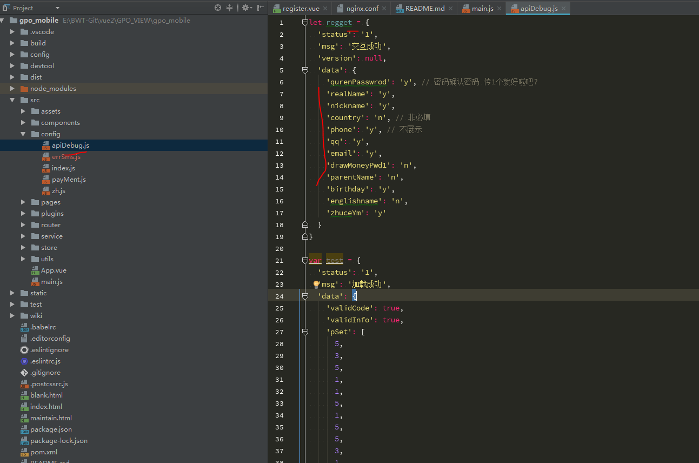
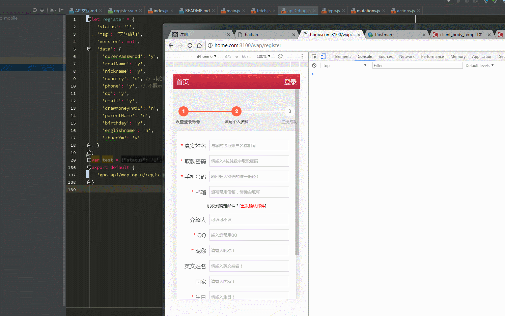

## API 交互
     http://home.com:3100
     本地 解析 127.0.0.1 home.com
    
    vue  端口号 8989
    Java 端口号 8180

## 接口调试 调试

    
    gpo_mobile\src\config\apiDebug.js
    let regget = { // 命名和 接口API 保持一致
        .....
        ....
        ....  里面内容 前后端 都可以查看修改
              方便调试
    }
    
    
    google 文档地址: 
    https://docs.google.com/document/d/1n3P4B5lJtrqLt5M2bcXmcHnWPEjFUTuGrXb8u8GTyDE/edit#heading=h.pczn03chwuax

## 接口可用的情况
    gpo_mobile\src\main.js
    取消 debug 修改代码为 ---> window.__DEBUG = null
    
    
## 接口不可用

     gpo_mobile\src\main.js
     修改代码为 ---> window.__DEBUG = true
     没有ajax 请求的

